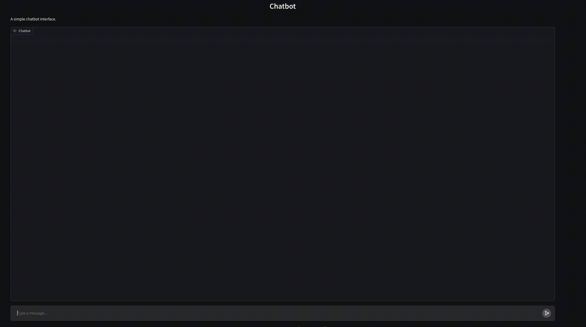

# Gradio Chatbot

## Demo

Below is a demo of the Gradio chatbot application:



## Features

- Interactive chatbot interface.
- Easy-to-use and customizable.
- Built with Python and Gradio.

## Installation

1. Clone the repository:
   ```bash
   git clone https://github.com/your-username/gradio-chatbot.git
   ```

2. Install the required dependencies using `uv`:
   ```bash
   uv install
   ```

## Usage

Export env variables

```bash
source env.sh
```

Run the chatbot application:
```bash
uv run src/main.py
```

Open your browser and navigate to the provided Gradio interface URL to interact with the chatbot.
